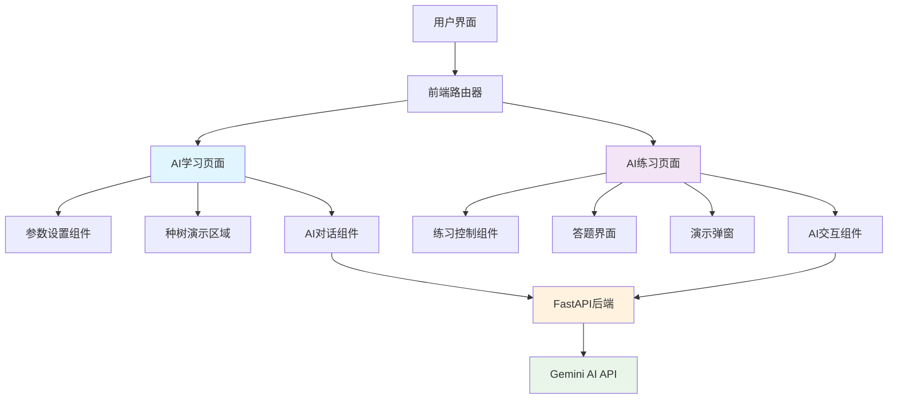
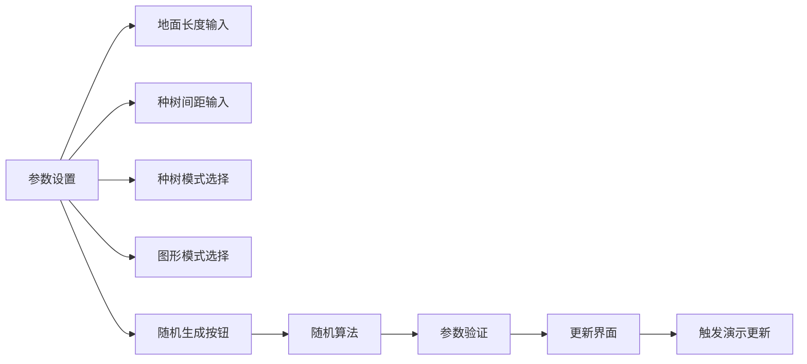
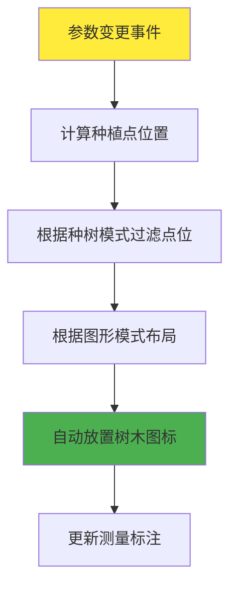
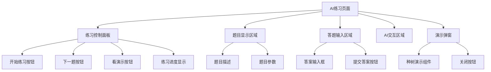
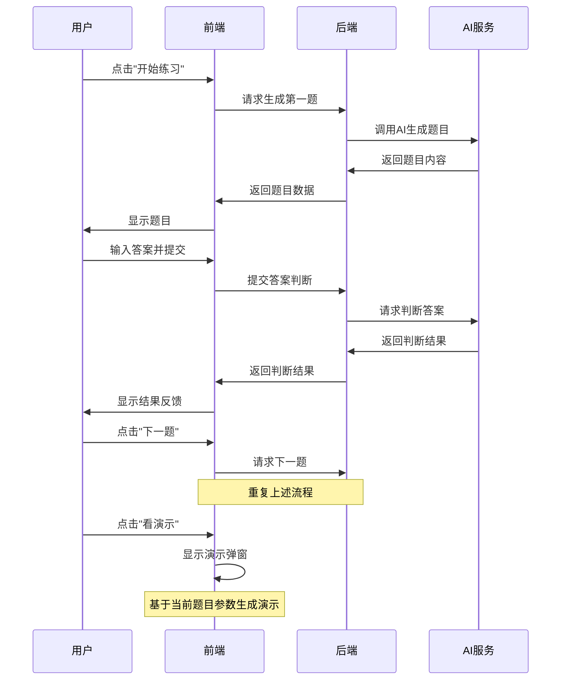
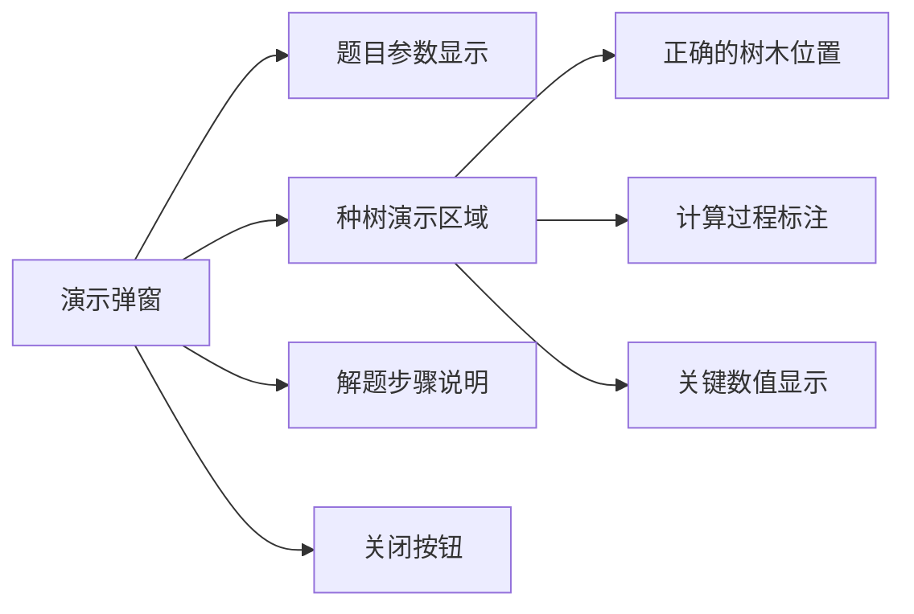

# AI学习模块重构设计文档

## 1. 概述

本文档描述了植树问题AI学习平台中AI学习模块的重构设计，以及新增AI练习模块的功能设计。重构的核心目标是将拖拽交互式学习转变为参数演示式学习，并新增AI练习功能来提供更系统化的学习体验。

### 1.1 项目背景
- **目标用户**: 小学五年级学生
- **当前架构**: 前端（纯JavaScript）+ 后端（FastAPI + Python）
- **AI模型**: Gemini 2.5 Flash
- **核心功能**: 植树问题可视化学习与AI智能辅导

### 1.2 重构范围
- AI学习模块功能重构
- 新增AI练习模块
- 前端页面结构调整
- 后端API扩展

## 2. 技术栈与架构

### 2.1 技术栈
- **前端**: 原生JavaScript (ES6+)、HTML5 Canvas/SVG、CSS3
- **后端**: FastAPI + Python 3.11
- **AI模型**: Gemini 2.5 Flash API
- **部署**: Docker + Zeabur

### 2.2 系统架构



## 3. AI学习模块重构

### 3.1 功能变更概述

#### 3.1.1 参数设置区域增强
- **新增功能**: 随机生成按钮
- **功能描述**: 点击后自动随机生成合理的参数组合

#### 3.1.2 拖拽区域转换
- **原功能**: 用户可拖拽树木到地面上种植
- **新功能**: 种树区域演示，自动根据参数设置显示正确的树木位置
- **变更**: 移除用户拖拽交互，改为只读演示

#### 3.1.3 AI对话优化
- **移除依赖**: AI不再读取种树区域的拖拽状态
- **新的数据源**: 直接读取参数设置的配置信息
- **默认输入**: 输入框默认填入"解读演示"

### 3.2 详细设计

#### 3.2.1 参数设置组件重构



**随机生成逻辑**:
- 地面长度: 50-200米 (步长10)
- 种树间距: 5-25米 (步长5)
- 种树模式: 随机选择四种模式之一
- 图形模式: 随机选择四种图形之一
- 确保生成的参数组合是数学上合理的

#### 3.2.2 种树演示区域重构



**演示功能特性**:
- 实时同步参数设置
- 自动计算正确的树木位置
- 移除所有拖拽交互事件
- 保持视觉吸引力和教育价值

#### 3.2.3 AI对话组件优化

**数据源变更**:
```javascript
// 原来的数据获取方式 (基于拖拽状态)
getInteractionState() {
  return {
    trees: trees.filter(t => t.isPlaced),
    ground: groundConfig,
    tree_mode: mode,
    shape_mode: shape
  };
}

// 新的数据获取方式 (基于参数设置)
getParameterState() {
  return {
    ground: {
      length: parseFloat(groundLengthInput.value),
      interval: parseFloat(treeIntervalInput.value)
    },
    tree_mode: treeModeSelect.value,
    shape_mode: shapeModeSelect.value,
    calculated_trees: calculateCorrectTreePositions()
  };
}
```

## 4. AI练习模块设计

### 4.1 功能概述

AI练习模块提供系统化的练习功能，包含题目生成、答题交互、演示展示和学习评估等完整功能。

### 4.2 页面结构设计



### 4.3 核心功能流程

#### 4.3.1 练习流程设计



#### 4.3.2 题目生成策略

**题目类型分类**:
1. **基础直线题目** (第1-2题)
   - 两端都种/都不种
   - 简单的间距和长度

2. **进阶直线题目** (第3题)
   - 一端种一端不种
   - 较复杂的参数组合

3. **图形题目** (第4题)
   - 圆形或正方形种植
   - 引入周长概念

4. **综合应用题目** (第5题)
   - 多种模式混合
   - 实际应用场景

### 4.4 演示弹窗设计

演示弹窗复用AI学习模块中的种树演示组件，但针对练习场景进行定制:



**演示特性**:
- 根据当前练习题目的参数自动配置
- 显示正确的树木布局
- 提供解题思路的可视化说明
- 支持不同图形模式的演示

### 4.5 学习评估系统

完成5道题目后，AI根据学生的答题情况提供综合评估:

**评估维度**:
- 答题正确率
- 答题速度
- 错误类型分析
- 学习建议

**评估报告格式**:
```markdown
## 学习评估报告

### 总体表现
- 答题正确率: X/5
- 平均答题时间: X分钟

### 知识点掌握情况
- ✅ 基础间距计算: 掌握良好
- ⚠️ 图形种植: 需要加强
- ❌ 复杂应用: 需要重点练习

### 学习建议
1. 建议多练习圆形和正方形种植的计算方法
2. 注意区分不同种植模式的计算公式
3. 可以尝试更多实际应用场景的练习
```

## 5. 前端实现方案

### 5.1 路由扩展

```javascript
// 扩展现有路由配置
const routes = {
  '': AILearning,
  '#/': AILearning,
  '#/ai-learning': AILearning,
  '#/ai-practice': AIPractice,  // 新增AI练习路由
};
```

### 5.2 页面组件结构

```
assets/js/pages/
├── ai-learning.js      # 重构后的AI学习页面
├── ai-practice.js      # 新增的AI练习页面
└── components/
    ├── tree-demo.js    # 可复用的种树演示组件
    ├── chat-widget.js  # 可复用的AI对话组件
    └── parameter-panel.js  # 可复用的参数面板组件
```

### 5.3 核心组件设计

#### 5.3.1 种树演示组件 (TreeDemo)

```javascript
class TreeDemo {
  constructor(options) {
    this.container = options.container;
    this.parameters = options.parameters;
    this.isReadOnly = options.readOnly || false;
  }
  
  updateParameters(newParams) {
    this.parameters = newParams;
    this.redraw();
  }
  
  redraw() {
    // 基于参数计算正确的树木位置
    // 清空现有树木
    // 自动放置新的树木
    // 更新测量标注
  }
}
```

#### 5.3.2 练习管理器 (PracticeManager)

```javascript
class PracticeManager {
  constructor() {
    this.currentQuestion = 0;
    this.totalQuestions = 5;
    this.answers = [];
    this.startTime = null;
  }
  
  async startPractice() {
    this.currentQuestion = 1;
    this.startTime = Date.now();
    const question = await this.generateQuestion(1);
    this.displayQuestion(question);
  }
  
  async submitAnswer(answer) {
    const result = await this.checkAnswer(answer);
    this.answers.push(result);
    this.displayResult(result);
  }
  
  async nextQuestion() {
    if (this.currentQuestion < this.totalQuestions) {
      this.currentQuestion++;
      const question = await this.generateQuestion(this.currentQuestion);
      this.displayQuestion(question);
    } else {
      await this.showFinalEvaluation();
    }
  }
}
```

## 6. 后端API扩展

### 6.1 新增API端点

#### 6.1.1 生成练习题目

```
POST /api/practice/generate-question
```

**请求体**:
```json
{
  "question_number": 1,
  "difficulty_level": "basic"
}
```

**响应**:
```json
{
  "question_id": "q1_20241215_001",
  "question_text": "在一条100米长的道路两边种树，每隔10米种一棵，两端都要种树。请问一共需要种多少棵树？",
  "parameters": {
    "length": 100,
    "interval": 10,
    "mode": "both",
    "shape": "line"
  },
  "expected_answer": 22,
  "difficulty": "basic"
}
```

#### 6.1.2 检查答案

```
POST /api/practice/check-answer
```

**请求体**:
```json
{
  "question_id": "q1_20241215_001",
  "user_answer": 22,
  "parameters": {
    "length": 100,
    "interval": 10,
    "mode": "both",
    "shape": "line"
  }
}
```

**响应**:
```json
{
  "is_correct": true,
  "correct_answer": 22,
  "explanation": "正确！在100米长的道路上，每隔10米种一棵树，两端都种，共有10个间隔，需要11棵树。因为是道路两边，所以总共需要 11 × 2 = 22棵树。",
  "solving_steps": [
    "道路长度 ÷ 间距 = 间隔数：100 ÷ 10 = 10个间隔",
    "两端都种：树的棵数 = 间隔数 + 1 = 10 + 1 = 11棵",
    "道路两边：总棵数 = 11 × 2 = 22棵"
  ]
}
```

#### 6.1.3 生成学习评估

```
POST /api/practice/evaluate
```

**请求体**:
```json
{
  "practice_session": {
    "answers": [
      {
        "question_number": 1,
        "is_correct": true,
        "time_spent": 120,
        "attempts": 1
      }
    ],
    "total_time": 600,
    "completion_date": "2024-12-15T10:30:00Z"
  }
}
```

### 6.2 AI Prompt优化

#### 6.2.1 题目生成Prompt

```python
def generate_question_prompt(question_number: int, difficulty: str) -> str:
    return f"""
你是一个专门为小学五年级学生设计植树问题的AI助手。

请生成第{question_number}道植树问题练习题：

**难度要求**: {difficulty}
**题目要求**:
1. 适合五年级学生的理解水平
2. 数值设置要便于计算
3. 包含清晰的问题描述
4. 提供准确的答案和解题步骤

**参数范围**:
- 长度: 50-200米 (步长10)
- 间距: 5-25米 (步长5)  
- 模式: 两端都种/两端都不种/一端种一端不种/环形种植
- 图形: 直线/圆形/三角形/正方形

请生成一道符合要求的练习题。
"""
```

#### 6.2.2 答案检查Prompt

```python
def check_answer_prompt(question: dict, user_answer: int) -> str:
    return f"""
你是一个植树问题的批改助手。

**题目信息**:
{question['question_text']}

**题目参数**:
- 长度: {question['parameters']['length']}米
- 间距: {question['parameters']['interval']}米
- 模式: {question['parameters']['mode']}
- 图形: {question['parameters']['shape']}

**学生答案**: {user_answer}
**正确答案**: {question['expected_answer']}

请提供:
1. 判断答案是否正确
2. 详细的解题步骤
3. 如果错误，指出可能的错误原因
4. 鼓励性的反馈

回答要温和、具体，适合五年级学生理解。
"""
```

## 7. 测试策略

### 7.1 功能测试

#### 7.1.1 AI学习模块测试
- 参数随机生成功能测试
- 种树演示自动更新测试  
- AI对话数据源切换测试
- 移除拖拽交互验证

#### 7.1.2 AI练习模块测试
- 题目生成逻辑测试
- 答案判断准确性测试
- 演示弹窗功能测试
- 学习评估算法测试

### 7.2 用户体验测试

#### 7.2.1 移动端适配测试
- 演示弹窗在移动端的显示效果
- 答题输入在移动端的操作体验
- 练习流程在小屏幕上的可用性

#### 7.2.2 AI交互测试
- AI生成题目的质量和多样性
- AI判断答案的准确性
- AI提供反馈的教育价值

## 8. 部署与监控

### 8.1 部署配置

现有的Docker和Zeabur部署配置无需修改，新功能将通过API扩展实现。

### 8.2 监控指标

#### 8.2.1 功能使用情况
- AI学习模块使用频率
- AI练习模块完成率
- 各类题目的错误率分布

#### 8.2.2 性能监控
- AI API响应时间
- 题目生成成功率
- 用户会话持续时间